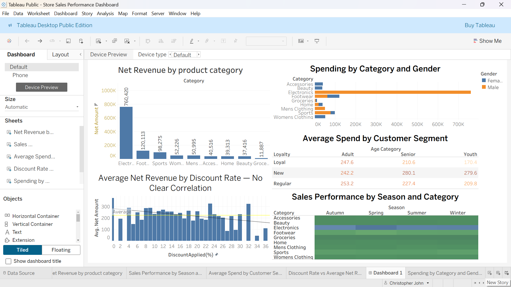

# Store_Sales_perfomance_Anaalysis
This projects is an end to end analysis covering 5000 retail transactions across 9 products categories. It entails data cleaning, exploration, visualization, and business recommendations.
Tools Used: Microsoft excel, Tableau public
Datasets: 5000 rows, 9 variables, retail transactions

## Business Questions
This analysis was designed to answer the following 
organisational questions:

1. Which product categories drive the most revenue?
2. Which season drives the highest sales performance?
3. Does the discounting strategy positively impact revenue?
4. Which customer segments represent the highest value?
5. Are there gender-based differences in spending behaviour?
6. Which product categories are underperforming and why?
   
## Data Cleaning Process
The following checks were performed on the raw dataset:

**Validation Check -Finding	- Action Taken**
Duplicate Records - 0 found-None required
Null Values -	0 found	- None required
Age Range (18-100) - All valid - None required
Item Rating (1-5)	- All valid	- None required
Negative Amounts	- None found	- None required
Text Consistency	- No anomalies	- None required

Three calculated columns were engineered:
- Net Amount = Amount × (1 − Discount% / 100)
- Age Group = Derived from Age using IF logic
- Customer Loyalty = Derived from Previous Purchases

  ## Key Findings
  
### Revenue & Category Performance
- Electronics is the highest revenue category at $760,420, 
  driven by high unit prices rather than transaction volume
- Footwear has the highest average transaction value, 
  indicating premium pricing relative to discount rates
- Groceries significantly underperforms — only 4 products 
  types available vs 30 across other categories, suggesting 
  understocking of key necessity items

### Seasonal Trends
- Spring is the strongest season across both transactions 
  volume and total revenue
- Electronics peaks in Spring, representing the single the 
  highest Category-Season revenue combination

### Customer Segments
- Regular Adults represent 60% of the customer base and 
  generate the highest average spend
- This segment should be the primary focus of loyalty 
  programmes and retention marketing

### Discounting Strategy
- Discount rates show no positive correlation with revenue
- Higher discounts produce marginally lower average net 
  revenue without increasing transaction volume
- Current discounting strategy may be eroding margins 
  with no measurable commercial benefit

### Gender Insights
- Male customers dominate Electronics spending
- Female customers are the primary drivers of Footwear 
  and Womens Clothing revenue
- Home category shows gender parity — suggesting household 
  rather than individual purchase decisions

  ## Business Recommendations

1. **Invest in Spring campaigns** — maximise the strongest 
   Revenue season with targeted promotions, especially 
   in Electronics

2. **Review discount strategy** — data shows discounting 
   does not drive revenue. Consider reducing discount 
   ceiling from 36% to 20% to protect margins

3. **Expand Grocery range** — only 4 SKUs currently 
   available. Expanding to cover key necessities could 
   significantly increase transaction volume in this category

4. **Build a Regular Adult loyalty programme** — this The 
   segment is 60% of customers and the highest spenders. 
   A structured loyalty programme would improve retention

5. **Gender-targeted marketing** — direct Electronics 
   campaigns toward male customers and Footwear/Clothing 
   campaigns toward female customers for better ROI

6. **Investigate Home category opportunity** — gender-neutral 
   spending suggests household marketing campaigns could 
   unlock higher revenue in this segment

## Dashboard

🔗 [View Interactive Tableau Dashboard](#[your-tableau-public-link](https://public.tableau.com/app/profile/christopher.john7582/viz/StoreSalesPerformanceDashboard_17722205108080/Dashboard1?publish=yes))

## How to Use This Repository
1. Download store_sales.csv for the raw data
2. Open Store_Sales_Portfolio.xlsx for the cleaned 
   workbook and pivot tables
3. Click the Tableau link above for the interactive dashboard

